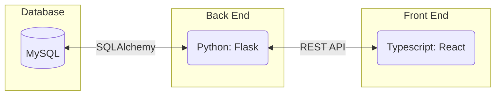

# Requirements and Specification Document

## Pseudoku

### Project Abstract

<!--A one paragraph summary of what the software will do.-->

The goal of this project is to create a sudoku web app that mimics the process of completing a sudoku puzzle on
"analog" pencil and paper. Because of this goal the user interface should be just as intuitive as a pencil and paper, providing the user with all the advantages of a physical puzzle solving experience while still being fully online. 

### Customer

<!--A brief description of the customer for this software, both in general (the population who might eventually use such a system) and specifically for this document (the customer(s) who informed this document). Every project will have a customer from the CS506 instructional staff. Requirements should not be derived simply from discussion among team members. Ideally your customer should not only talk to you about requirements but also be excited later in the semester to use the system.-->

### User Requirements

<!--This section lists the behavior that the users see. This information needs to be presented in a logical, organized fashion. It is most helpful if this section is organized in outline form: a bullet list of major topics (e.g., one for each kind of user, or each major piece of system functionality) each with some number of subtopics.-->

| ID   | Description                                                  | Priority | Status | Test Plan                                                    |
| ---- | ------------------------------------------------------------ | -------- | ------ | ------------------------------------------------------------ |
| R1 | Users shall be provided with an uncompleted version of the sudoku puzzle and a completed answer sheet (upon request). | High | Open | This is our test plan. |
| R2 | Users shall be able to solve the sudoku puzzle presented. | High | Open |
| R2.1 | Users shall be able to attempt to solve the sudoku puzzle by entering in values. | High | Open |
| R2.2 | Users shall be able to annotate the boxes of the sudoku puzzle with possible values. | High | Open |
| R2.3 | Users shall be able to see if any of their moves are invalid. | High | Open |
| R3 | Users shall be able to start a new game and generate a new sudoku puzzle. | Medium | Open |
| R4 | Users shall be able to select the degree of difficulty of the sudoku puzzle they are solving. | Medium | Open |
| R5 | Users shall be able to have an account within the sudoku application. | Medium-Low | Open |
| R5.1 | Users shall be able to login to their account with a previously saved username and password. | Medium-Low | Open |
| R5.2 | Users shall be able to save generated sudoku puzzles to their account which can be selected upon login. | Low | Open |
| R5.3 | Users shall be able to save their progress on a sudoku puzzle to their account which can be continued later. | Low | Open |
| R6 | Users shall be able to see how long they have spent trying to solve the sudoku puzzle. | Low | Open |
| R7 | Users shall have access to sudoku variants in addition to standard sudoku. | Low | Open |

<small><i>Table 1-1 requirements</i></small>

### Figma Prototype
We have created a high fidelity prototype of our Sudoku application using Figma.

The full prototype can be found [here](https://www.figma.com/file/gDVxq0N7kbBzlIZ1ySW40q/issue_21?type=design&node-id=0%3A1&mode=design&t=3KzTdZH16Ck1aMVe-1).

#### Technology Stack

#### Database
Usage information:
Storing and retrieving board information from the database in this format:

    [
        boardId,
        num00,
        num01,
        num02,
        ...
    ]

#### System Architecture Diagram

### Standards & Conventions

<!--Here you can document your coding standards and conventions. This includes decisions about naming, style guides, etc.-->
