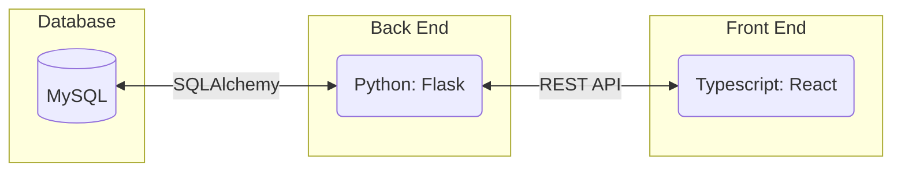

# Requirements and Specification Document

## Pseudoku

### Project Abstract

<!--A one paragraph summary of what the software will do.-->

The goal of this project is to create a sudoku web app that mimics the process of completing a sudoku puzzle on
"analog" pencil and paper. Because of this goal the user interface should be just as intuitive as a pencil and paper, providing the user with all the advantages of a physical puzzle solving experience while still being fully online. 

### Customer

<!--A brief description of the customer for this software, both in general (the population who might eventually use such a system) and specifically for this document (the customer(s) who informed this document). Every project will have a customer from the CS506 instructional staff. Requirements should not be derived simply from discussion among team members. Ideally your customer should not only talk to you about requirements but also be excited later in the semester to use the system.-->

### User Requirements and Test Plan

<!--This section lists the behavior that the users see. This information needs to be presented in a logical, organized fashion. It is most helpful if this section is organized in outline form: a bullet list of major topics (e.g., one for each kind of user, or each major piece of system functionality) each with some number of subtopics.-->

| ID   | Description  | Priority | Status | Test Plan   |
| ---- | ------------ | -------- | ------ | ------------|
| R1 | Users shall be provided with an uncompleted version of the sudoku puzzle and a completed answer sheet (upon request). | High | Open (Finished) | The user should be presented with an uncompleted version of the sudoku puzzle when they access the application. Additionally, upon user request, the completed answer sheet should be provided. |
| R2 | Users shall be able to solve the sudoku puzzle presented. | High | Open(Finished) | The user should be able to solve the sudoku puzzle in various ways. |
| R2.1 | Users shall be able to attempt to solve the sudoku puzzle by entering in values. | High | Open(Finished) | The user should be able to enter in a value into a selected box within the sudoku puzzle. |
| R2.2 | Users shall be able to annotate the boxes of the sudoku puzzle with possible values. | High | Open(Finished) | The user should be able to annotate a selected box within the sudoku puzzle with possible values. |
| R2.3 | Users shall be able to see if any of their moves are invalid. | High | Open(Finished) | The user should be informed if any of their moves are invalid while attempting to solve the sudoku puzzle. |
| R2.4 | Users shall be able to delet or change the values they entered. | High | Open(Finished) | The user should be able to  delete or change the value that has been entered. Allowing the user to make adjustments without restarting the game. |
| R2.5 | Users shall be able undo the last operation.| Low | Close | The user should be undo the last number they entered. |
| R3 | Users shall be able to start a new game and generate a new sudoku puzzle. | Medium | Open(Finished) | The user should be able to press a button and start a new sudoku game. The press of this button should generate a new sudoku puzzle for the user. |
| R4 | Users shall be able to select the degree of difficulty of the sudoku puzzle they are solving. | Medium-low | Open(Finished) | The user should be given a choice of difficulty that they can select from when generating a new sudoku puzzle. The selection of a level of difficulty should correspond to the amount of the board that is pre-filled. |
| R5 | Users shall be able to have an account within the sudoku application. | Medium-Low | Open(Finished) | The user should have an account within the sudoku application that allows various functionalities. |
| R5.1 | Users shall be able to login to their account with a previously saved username and password. | Medium-Low | Open(Finished) | The user should be able to use a previously saved username and password to log into their sudoku account when accessing the application. |
| R5.2 | Users shall be able to save generated sudoku puzzles to their account which can be selected upon login. | Low | Open(Finished) | The user should be able to save generated sudoku puzzles to their account. Upon login, the user should be able to view the saved puzzles which can then be selected by the user. |
| R5.3 | Users shall be able to save their progress on a sudoku puzzle to their account which can be continued later. | Low | Open(Finished) | The user should be able to save their current progress on a sudoku puzzle. Only numbers that have already been filled in should be saved, annotations should not be saved. The saved puzzle should appear in the user's account for continuation later. |
| R5.4 | Users shall be able to log out from their account. | Low | Open(Finished) | The user should be able to log out for he current account. |
| R6 | Users shall be able to see how long they have spent trying to solve the sudoku puzzle. | Low | Open(Finished) | The user should be able to see a timer on their application screen that displays the amount of time they have spent trying to solve the sudoku puzzle. |
| R7 | Users shall have access to sudoku variants in addition to standard sudoku. | Low | Close | The user should have the option to select from standard sudoku or a sudoku variant to play upon login. |
| R8 | Users shall be able to go back to the main menu to pick different difficult level board. | High | Open(Finished) | The user should be able to exit the game to main menu and start a new game |

<small><i>Table 1-1 Requirements and Test Plan</i></small>

### Figma Prototype
We have created a high fidelity prototype of our Sudoku application using Figma.

The full prototype can be found [here](https://www.figma.com/file/gDVxq0N7kbBzlIZ1ySW40q/issue_21?type=design&node-id=0%3A1&mode=design&t=3KzTdZH16Ck1aMVe-1).

#### Technology Stack

#### Database
Usage information:
Storing and retrieving board information from the database in this format:

    [
        boardId,
        num00,
        num01,
        num02,
        ...
    ]

#### System Architecture Diagram

### Standards & Conventions

<!--Here you can document your coding standards and conventions. This includes decisions about naming, style guides, etc.-->
